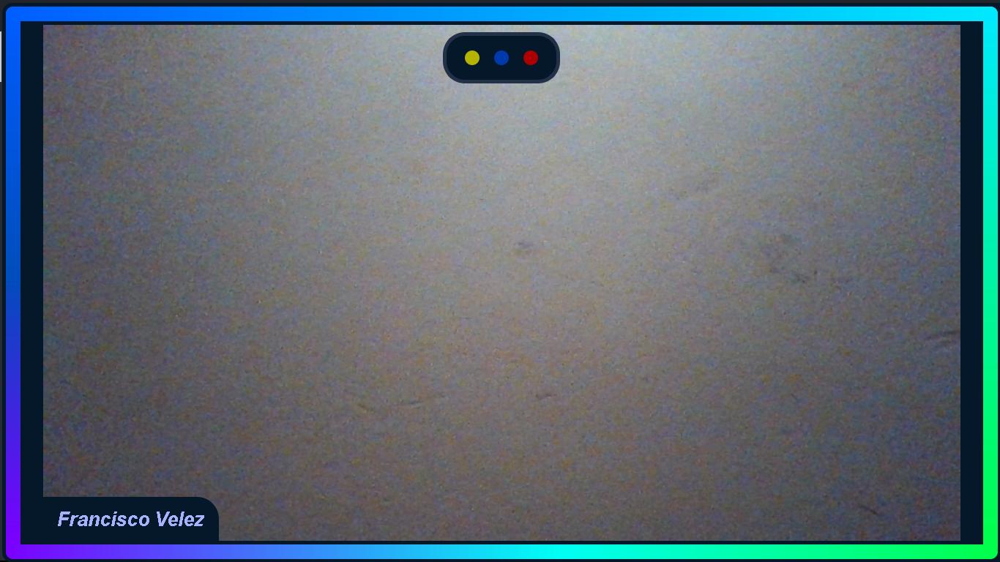
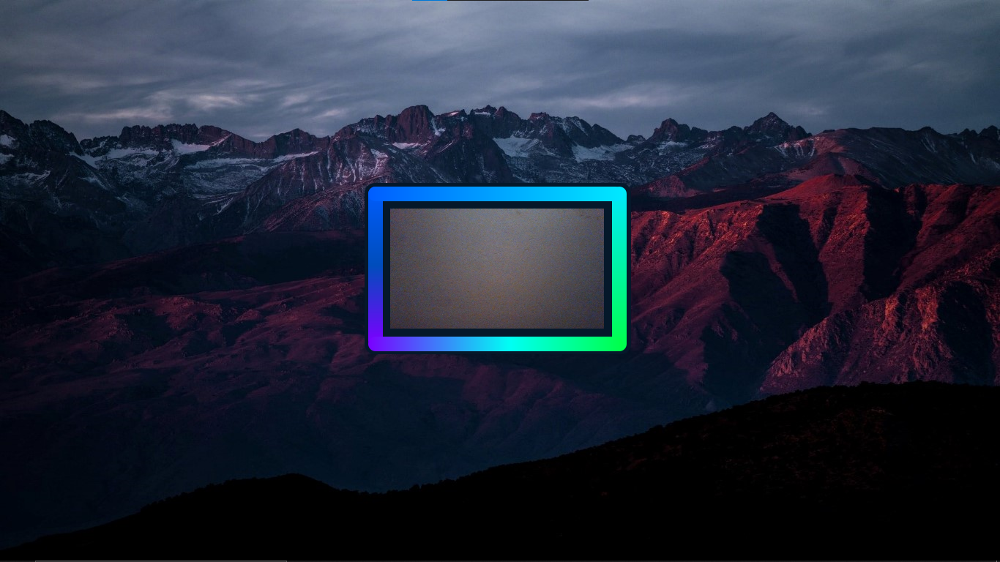

# PyQt5-Camara
Project #3 with Python - PyQt5. Uses the camera resource.

Uses the camera resource and contains animations, full screen camera, 
mini screen camera, the previous ones with keyboard shortcuts.

You can also move window with cursor and move window with keyboard 
shortcuts, among others and more improvements.

## Viewer Shortcuts
* Ctrl + 1 = Run/Stop animation.
* Ctrl + 0 = End the animation.

* Ctrl + Q = Move window to top right corner.

* Ctrl + C = Close the window.
* Ctrl + M = minimize window.

* Ctrl + A = Move window 10px to the Right.
* Ctrl + D = Move window 10px to the Left.
* Ctrl + W = Move window 10px Up.
* Ctrl + S = Move window 10px Down.

* Ctrl + U = Esconder Borde.
* Ctrl + I = Mostrar Borde.

* Ctrl + K = Ventana Tamaño completa.
* Ctrl + N = Ventana Tamaño mini.

**Image 1**

**Image 2**

**Best regard !!!**

<cite>Author: Francisco Velez</cite>
